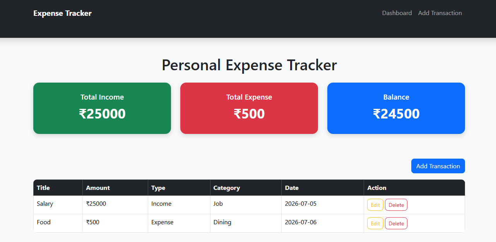
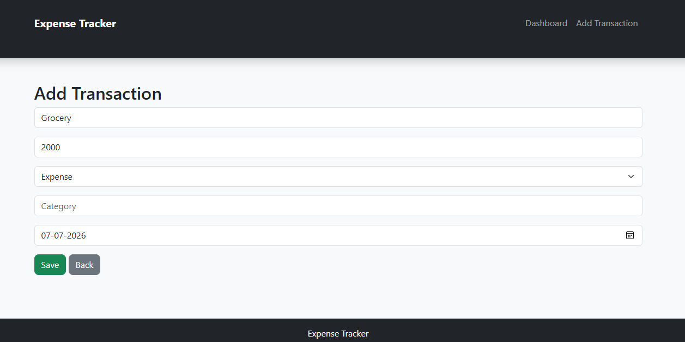
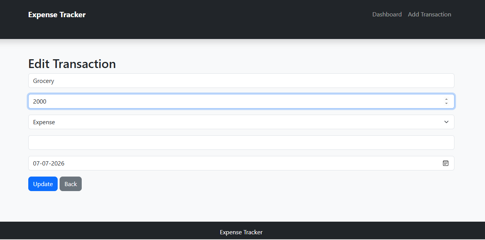
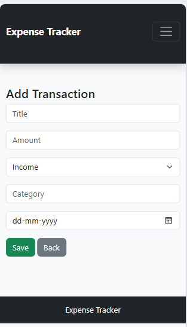

# Personal Expense Tracker

## Overview

Personal Expense Tracker is a full-stack web application that helps users manage their income and expenses efficiently. Users can add, view, update, and delete transactions while tracking their overall financial balance.

This project demonstrates database integration and CRUD operations using Node.js, Express.js, SQLite, and Bootstrap.

---
## Live Demo

https://task-3-krishna-prakash-expensetracker-1.onrender.com/

## Features

* Add new transactions
* View all transactions
* Edit existing transactions
* Delete transactions
* Track total income
* Track total expenses
* Calculate current balance
* Responsive user interface
* SQLite database integration
* Full CRUD functionality

---

## Tech Stack

### Frontend

* HTML5
* CSS3
* Bootstrap 5
* JavaScript

### Backend

* Node.js
* Express.js

### Database

* SQLite3

---

## Project Structure

```text
project3-expensetracker
│
├── database
│   └── db.js
│
├── routes
│   └── transactions.js
│
├── public
│   ├── index.html
│   ├── add.html
│   ├── edit.html
│   ├── style.css
│   └── script.js
│
├── server.js
├── package.json
└── README.md
```

---

## CRUD Operations

### Create

Add new income or expense transactions.

### Read

View all transactions and dashboard statistics.

### Update

Modify existing transaction details.

### Delete

Remove unwanted transactions.

---

## API Endpoints

| Method | Endpoint              | Description           |
| ------ | --------------------- | --------------------- |
| GET    | /api/transactions     | Get all transactions  |
| GET    | /api/transactions/:id | Get transaction by ID |
| POST   | /api/transactions     | Create transaction    |
| PUT    | /api/transactions/:id | Update transaction    |
| DELETE | /api/transactions/:id | Delete transaction    |

---

## Installation

### Clone Repository

```bash
git clone <repository-url>
```

### Navigate to Project Folder

```bash
cd project3-expensetracker
```

### Install Dependencies

```bash
npm install
```

### Start Application

```bash
npm run dev
```

### Open Browser

```text
http://localhost:5000
```

---

## Screenshots

### Dashboard



### Add Transaction Page



### Edit Transaction Page



### Mobile View



---

## Future Enhancements

* Transaction search and filtering
* Expense categories with charts
* Monthly reports
* User authentication
* Export transactions to CSV/PDF

---

## Learning Outcomes

* Backend development with Express.js
* Database integration using SQLite
* REST API development
* CRUD operations
* Frontend and backend communication
* Responsive web design

---

## Author

Krishna Prakash </br>
DecodeLabs Internship Project 3 - Database Integration
